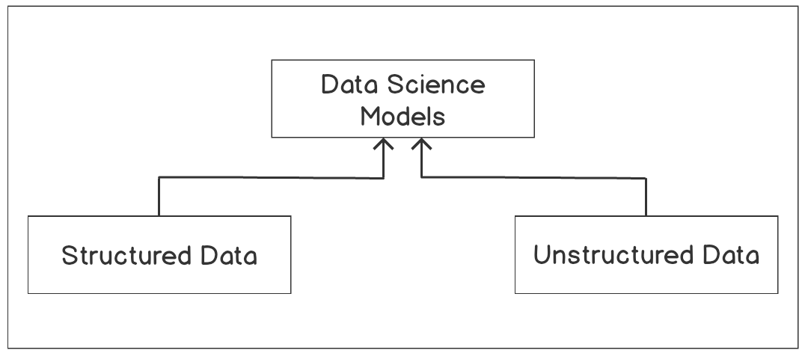
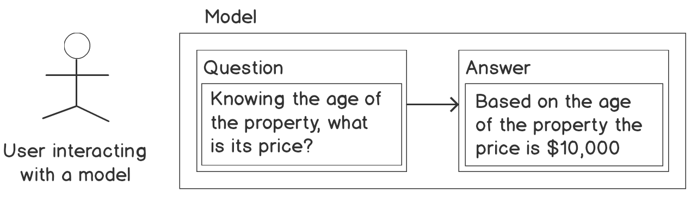

# Regression

In this repository, you will be able to identify and import the Python modules required for regression analysis; use the pandas module to load a dataset and prepare it for regression analysis; create a scatter plot of bivariate data and fit a regression line through it; use the methods available in the Python statsmodels module to fit a regression model to a dataset; explain the results of simple and multiple linear regression analysis; assess the goodness of fit of a linear regression model; and apply linear regression analysis as a tool for practical problem-solving.

This lesson is an introduction to linear regression analysis and its application to practical problem-solving in data science. You will learn how to use Python, a versatile programming language, to carry out regression analysis and examine the results. The use of the logarithm function to transform inherently non-linear relationships between variables and to enable the application of the linear regression method of analysis will also be introduced.

# Introduction

The previous lesson provided a primer to Python programming and an overview of the data science field. Data science is a relatively young multidisciplinary field of study. It draws its concepts and methods from the traditional fields of statistics, computer science, and the broad field of artificial intelligence (AI), especially the subfield of AI called machine learning:

.

<b>Figure 1.1: The data science models </b>

As you can see in *Figure 2.1*, data science aims to make use of both **structured** and **unstructured** data, develop models that can be effectively used, make predictions, and also derive insights for decision making.

A loose description of structured data will be any set of data that can be conveniently arranged into a table that consists of rows and columns. This kind of data is normally stored in database management systems.

Unstructured data, however, cannot be conveniently stored in tabular form – an example of such a dataset is a text document. To achieve the objectives of data science, a flexible programming language that effectively combines interactivity with computing power and speed is necessary. This is where the Python programming language meets the needs of data science.

The need to develop models to make predictions and to gain insights for decision-making cuts across many industries. Data science is, therefore, finding uses in many industries, including healthcare, manufacturing and the process industries in general, the banking and finance sectors, marketing and e-commerce, the government, and education.

In this lesson, we will be specifically be looking at regression, which is one of the key methods that is used regularly in data science, in order to model relationships between variables, where the **target variable** (that is, the value you're looking for) is a real number.

Consider a situation where a real estate business wants to understand and, if possible, model the relationship between the prices of property in a city and knowing the key attributes of the properties. This is a data science problem and it can be tackled using regression.

This is because the target variable of interest, which is the price of a property, is a real number. Examples of the key attributes of a property that can be used to predict its value are as follows:

- The age of the property
- The number of bedrooms in a property
- Whether the property has a pool or not
- The area of land the property covers
- The distance of the property from facilities such as railway stations and schools

Regression analysis can be employed to study this scenario, in which you have to create a function that maps the key attributes of a property to the target variable, which, in this case, is the price of a property.

Regression analysis is part of a family of machine learning techniques called **supervised machine learning**. It is called supervised because the machine learning algorithm that learns the model is provided a kind of question and answer dataset to learn from. The question here is the key attribute and the answer is the property price for each property that is used in the study, as shown in the following figure:

*Figure 1.2: Example of a supervised learning technique* 

Once a model has been learned by the algorithm, we can provide the model with a question (that is, a set of attributes for a property whose price we want to find) for it to tell us what the answer (that is, the price) of that property will be.

This lesson is an introduction to linear regression and how it can be applied to solve practical problems like the one described previously in data science. Python provides a rich set of modules (libraries) that can be used to conduct rigorous regression analysis of various kinds. In this lesson, we will make use of the following Python modules, among others: **pandas**, **statsmodels**, **seaborn**, **matplotlib**, and **scikit-learn**.
